# 编译原理做题版

 

# 一、第四章 语法分析

- FIRST && FOLLOW
- 消除左递归，提取左公因子
- 预测分析表，分析表冲突
- 自顶向下算法过程
- 求句柄

## 1.First

1.终结符

2.非终结符

3.是否可以推导出空串

- **计算First时**要注意别漏掉==ε==

E’→or T E’| ==ε==

first(E’)=[or,==ε==]

- First是**ε**，FOLLOW 是**$** 两个都是空，但是符号不一样

 

- 计算每个符号串 α 的 First(α) 集合

  

 

## 2.FOLLOW

1.开始符号

2.中间符号

3.最后符号

 [

**计算FOLLOW(X)集合算法：**

- 为每个非终结符 X 计算 Follow(X) 集合

  

## 3.预测分析表算法

> t:A->α 退出的第一个终结符

[

[

## 4. 句柄

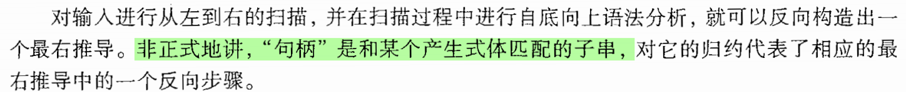

## 5.提取左公因子

## 6.消除左递归

### 消除立即左递归

### 通用消除

1.先把所有非终结符排序，A1,A1,....AN

2.从右往左，把An代入An-1,An-1带入An-2,在这个过程中发现一个左递归就灭掉一个

**例：**有文法S→Qc｜c，Q→Rb｜b，R→Sa｜a，消除文法的左递归。
　　以非终结符号排序为R，Q，S
　　**把R的产生式代入Q中有：**
　　Q → （Sa｜a）b｜b
　　Q → Sa b｜ab｜b
　　**把Q的产生式代入S中有：**
　　S → （Sa b｜ab｜b）c｜c 　 
　　S → Sa bc｜abc｜bc｜c
　　**消除直接左递归得到结果：**
　　S → abcS’｜bc S’｜cS’ 
　　S’→ abcS’｜ε
　　Q → Sa b｜ab｜b 
　　R → Sa｜a 
　　**Q 和 R的产生式是多余的删除，得到最终结果：**
　　S → abcS’｜bc S’｜cS’ 

　　S’→ abcS’｜ε

## 7.语法分析过程

### 1.自底向上

注意有标号，id1,id2什么的，然后还有栈底符号

 

### 2.自顶向下

## 8.LR0

### 1.CLOSURE(I)

---

**1.**假设此时状态为$I_k$,**输入符号$E$**,则$I_k$中所有==等式右边==**带有$·E$的式子转移到$I_{k+1}$**。

在$I_{K+1}$中，**$I_K$中的$·E$变成$E·$**如下图，白色部分为直接转移

**2.在集合内对当前部分进行闭包操作：**

​	for  ==任意 ·X== in  当前所有式子：

​			把所有==原生成式中 **X为左边**的式子==加入。

​			重复直到没有东西可以加入。

---

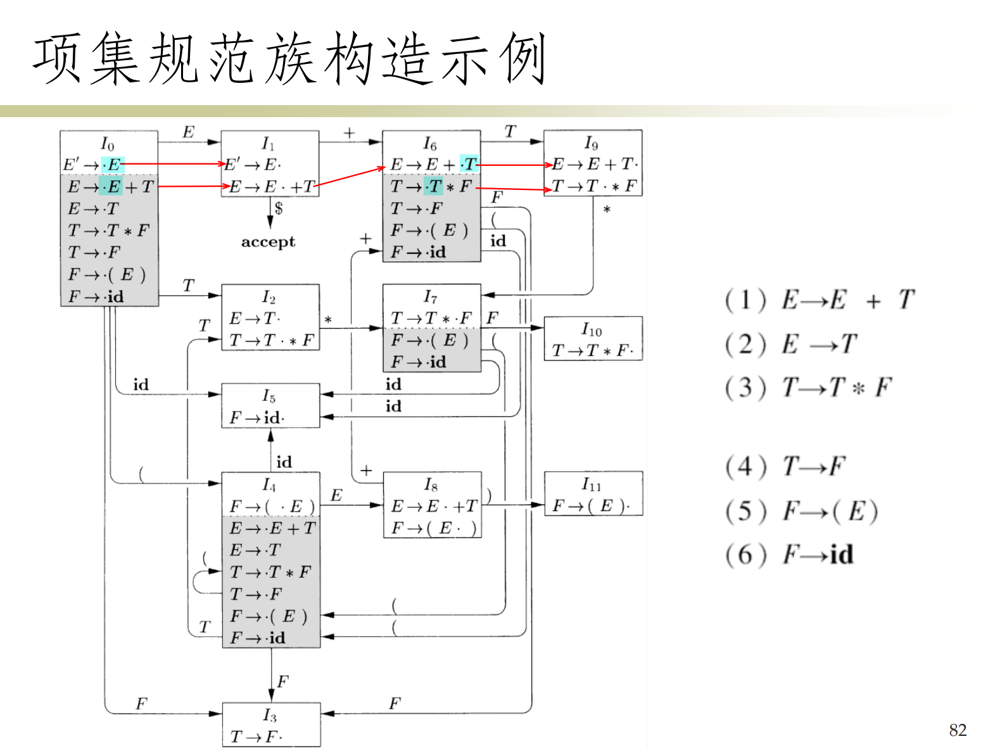

### 2.增广文法

加个初始符号  

### 3.GOTO 函数

## 9.LRs

> 什么时候是ri?
>
> 输入都到达尽头时.  $ A->X_1X_2X_3...X_N.$

**si (shift i)**：表示移入动作（shift action）。如果当前状态为s，并且下一个输入符号为a，则“si”表示将符号a移入栈中，同时状态机转移到状态i。 

**gi (goto i)**：表示转移动作（goto action）。在LR(0)分析中，如果当前状态为s，并且已经识别出一个非终结符A，则“gi”表示状态机从当前状态转移到状态i。 

**ri (reduce i)**：表示规约动作（reduce action）。如果当前状态为s，并且下一个输入符号a与产生式的右部匹配，则“ri”表示使用产生式i进行规约。规约动作会将产生式右部的符号从栈中弹出，并且将相应的非终结符推入栈中，然后依据goto表转移到新的状态。

**acc (accept)**：表示接受动作（accept action）。如果当前状态为s，并且下一个输入符号为输入串的结束符号（通常是$），则“acc”表示输入串被成功解析，分析过程结束，解析成功。

 

### 1.构造LR(0)分析表

> **转移**——非终结符：s；终结符：goto

---

1. 先构造出LR(0)自动机，每个自动机的状态对应LR(0)分析表中的一个状态

2. 根据以下规则，构造LR(0)分析表

   

3. 如果文法 G 的LR(0) 分析表是无冲突的, 则 G 是 LR(0) 文法

4. **填充分析表**：对于每一个项目集（状态），根据项目的类型（是移进、规约、还是接受）以及输入符号，填入相应的分析动作。特别注意以下几点：

   - **填入移进动作（shift action）**：如果项目集中存在形如`[A → α•aβ]`的项目，并且a是一个终结符，则在分析表中，将当前状态和符号a对应的单元格填入移进动作（即“si”，其中i是aβ闭包后的状态）。
   - **填入规约动作（reduce action）**：如果项目集中存在形如`[A → α•]`的项目（项目点已经在产生式右部的最末尾），则表示可以进行规约。这时需要在分析表中将当前状态和所有可以规约的输入符号**（在SLR中通常是FOLLOW(A)集中的符号）**对应的单元格填入规约动作（即“ri”，其中i是产生式编号）。如果当前项目集同时也是文法的开始状态的闭包，并且点在产生式末尾，则这是一个特殊情况，表示接受（acc）。
   - **填入接受动作（accept action）**：如果项目集中存在增广文法的开始符号的完成项目`[S' → S•]`，并且下一个输入符号是输入结束符号（$），则在分析表中填入接受动作（acc）。

---

==LR：**不能处理移入-规约冲突——**==ri都是一写就一整行的，即同一个I的块不能又有r又有s

#### 判断LR(0)文法

没有移入-规约冲突

没有规约-规约冲突

#### 例1

 

### 2.SLR(1)

LR(0) 分析表每一行 (状态) 所选用的**归约产生式**是相同的,**对LR(0)的规约规则进行改进**

**LR(0):**

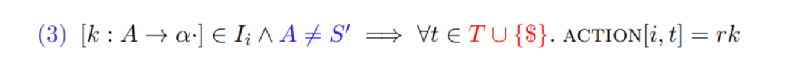

**SLR:**

> 当要规约A->α·时，只有当前终结符在FOLLOW(A)中时才规约

 

#### 判断SLR(1)文法

移入规约冲突

#### 例1

> (2) ->(3) id 规约成F，状态由I5转为I3，所以栈由（0 5）变成（0 3）
>
> (3) ->(5) F 规约成T，状态由I3转为I2，所以栈由（0 3）变成（0 2）

#### 例2

###  3.LR(1)

#### 3.1 LR(0)与SLR(1)存在的问题 

- LR0

  

- SLR1

  

#### 3.2 LR(1)项

**定义：**

> [A → α · β, a] (a ∈ T ∪ {$}) 此处, a 是向前看符号, 数量为 1

思想: α 在栈顶, 且剩余输入中开头的是可以从 βa 推导出的符号串

也就是说，[A → α·, a]：**只有下一个输入符号为 a 时, 才可以按照 A → α 进行归约**

#### 6.3 LR(1)自动机 

- **LR1闭包计算**

>$A->α·Bβ，S$ 
>
>$B->..., S_1$
>
>---
>
>1.$β为空$  or  $FIRST(β) 包含 ε(代入β就是β为空)$: 
>
>​	$S1∪=S$（照抄）
>
>2.$β不为空：$
>
>​	$S1∪=FIRST(β)$

- **LR1初始化**

  

- **LR1的GOTO计算**

  

- **LR1自动机构造**

  

#### 6.4 LR(1)分析表 

[] 

#### 6.5 例子

##### 1.

 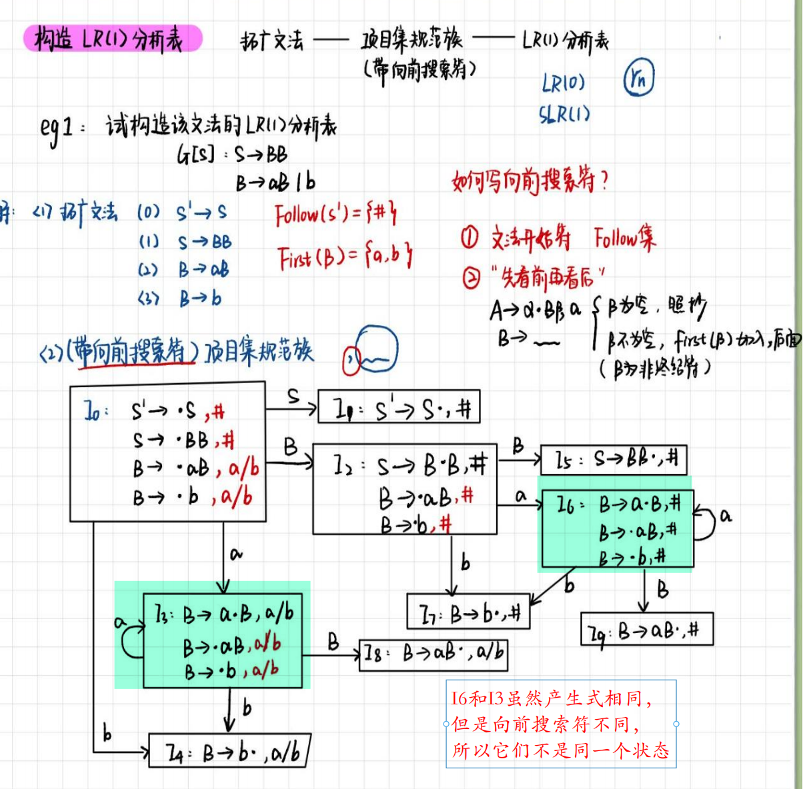 

##### 2.

##### 3. LR(1)分析表

> si和GOTO还是和原来一样
>
> ri只在==对应向前搜索符==的位置填ri

 

### 4.LALR(1)

#### 4.1 LR(1)的问题

LR(1) 虽然强大, 但是生成的 LR(1) 分析表可能过大, 状态过多

LALR(1) : **合并具有相同核心 LR(0)项的状态 (忽略不同的向前看符号)**

#### 4.2 合并核心项 

例如，合并图中的(4,7),(3,6),(8,9)

#### 4.3 引入冲突 

对于 LR(1) 文法, 合并得到的 LALR(1) 分析表是否会引入冲突？

- **不会**引入**移入/归约**冲突

  假设合并后出现冲突，[A → α·, a] 与 [B → β · aγ, b]

  则在 LR(1) 自动机中, 存在某状态同时包含 [A → α·, a] 与 [B → β · aγ, c] (c随便是什么)

- **可能会**引入**归约/归约**冲突

#### 4.4 例子

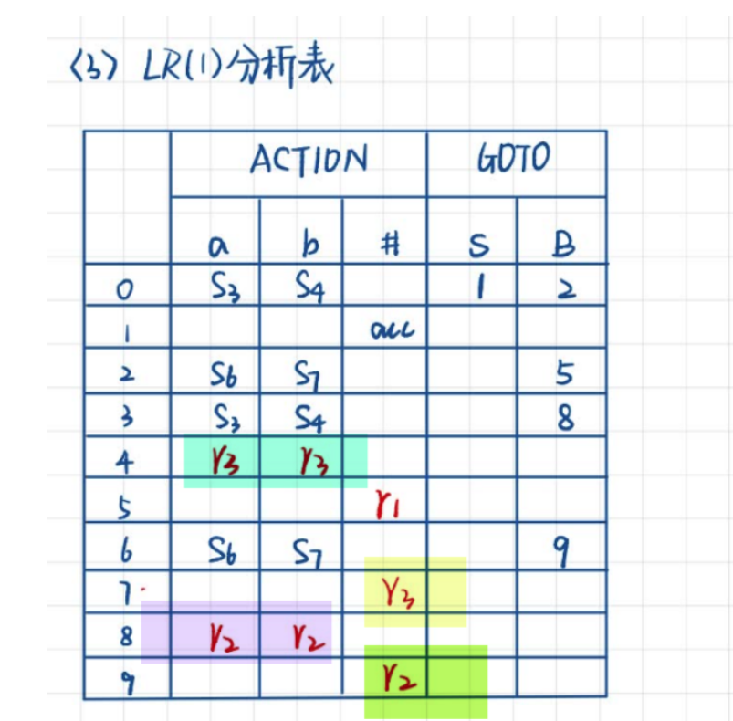

### 5.冲突

> **移入--归约冲突**：某一产生式的右部是另一产生式的前缀

> **归约--归约冲突**：不同产生式有相同的右部 或者 产生式的右部是另一产生式的后缀

举例如下：

### 6.四种文法区分

> **1.LR(0)文法：**

判断LR(0)文法的关键是构造一个LR(0)项目集族和相应的状态转移图。

检查是否存在移进-归约冲突或归约-归约冲突。如果没有冲突，该文法是LR(0)。

> **2.SLR(1)文法（简化的LR(1)文法）：**

首先构造LR(0)项目集族和状态转移图。

使用文法的FOLLOW集合来帮助决定在哪些状态上进行归约操作。

如果在任何状态下，对于任何输入符号，都只有一个明确的动作（移进或归约），则文法是SLR(1)。

> **3.LR(1)文法：**

构造LR(1)项目集族和相应的状态转移图。LR(1)项目包括LR(0)项目以及一个向前看符号。

检查是否存在移进-归约冲突或归约-归约冲突。如果没有冲突，该文法是LR(1)。

> **4.LALR(1)文法（查找-前的LR(1)文法）：**

首先构造LR(1)项目集族和状态转移图。

合并那些核心项目相同但向前看符号不同的状态，从而得到一个更小的状态集。

检查合并后的状态集中是否存在冲突。如果没有冲突，文法是LALR(1)。 

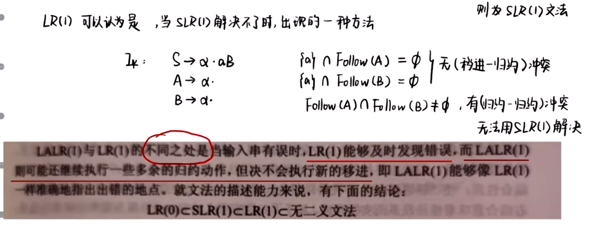

# 二、第五章 语义分析

## 1.构造注释分析树

> 1.画语法分析树
>
> 2.添加注释
>
> 

> 构造注释分析树实际上就是在求==“值的计算顺序”==

### 1.1 综合属性

https://www.youtube.com/watch?v=q1EDT2st7YQ

> **自下而上**

这个图真的是言简意赅↓

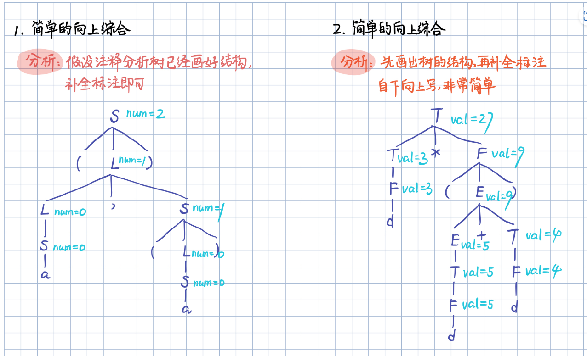

### 1.2 继承属性

> 就是一条线画过去
>
> 沿途路过的都是已知值
>
> 当前已知值能求出来的都求出来
>
> 然后这个就是求值顺序

 

## 2.扩展SDD

> 1. 消除**左递归**
>
>    
>
> 2. 一条一条列出来
>
>    - 表达式**不要有“|”**符号，
>
>    - 左右**相同的符号用序号区分**
>
> 3. 写出语义规则

## 3.SDD消除左递归

> 1. 不涉及属性值
> 2. 涉及属性值

---

> **记忆：**
>
> gf,fg,(前两次函数顺序) 
>
> ---
>
> is,is,si（变换后赋值顺序）
>
> 第一次参数 右1
>
> 第二次参数 左，右1
>
> 第一二次赋值 左=右2.s
>
> 第三次赋值 左.s-左.i

> **左=函数名称(右1，右2)**
>
> $A->A_1α\{A.a=g(A_1.a,α.c)\}$ 
>
> $A->β\{A.a=f(β.b)\}$
>
> ---
>
> $A->β\{A'.i=f(β.b)\} A'\{A.a=A'.s\}$  **A->β**{ 右2.i=f(右1) }**A'**{左.s=右2.s}
>
> $A'->α\{A'_1.i=g(A'.i,α.c)\}A'_1\{A'.s=A'_1.s\}$ A'->α{ 右2.i=g(左,右1)}A'{左.s=右2.s}
>
> $A'->ε\{A'.s=A'.i\}$ 左.s=左.i
>
> 

# 三、第六章 中间代码生成

## 1.DAG && 值编码

## 2. 四元式和三元式

==先画DAG图，再写三元式和四元式==

> 四元式：op arg1 arg2 res
>
> 三元式：标号 op arg1 arg2 标号代替了res

## 3.数组寻址

## 4.使用翻译方案来翻译下列赋值语句

> 1. 写出语法分析树
> 2. 写出三地址代码
> 3. 有New Temp() 就添加一个 $t_{i+1}$
> 4. 写 array ,type ,addr 有的多维数组生成的$t_i$不会出现在语法分析树中

---

---

> 上面的地址是下面的加起来

## 5.语法制导中添加控制链构造

> 第一步：画图。
>
> 1. 把**Label New 出来**
> 2. **赋值next**
> 3. Code语句:按照图从上到下直接顺下来，用"||"连接
> 4. 好像**两个块块之间连接一定要有Label** 虽然我不知道为什么

---

> 例题

 

## 6.布尔表达式的SDD

## 7.回填

> **OR 逻辑：**
>
> t:把 child节点的 trueList **取并集**
>
> f:**取后面那个**
>
> ---
>
> **And 逻辑：**
>
> t: **取后面那个**
>
> f:把 child节点的 falseList **取并集**
>
> ---
>
> **M的作用：**
>
> 要有M来标记指令位置，处理到M的时候会把M.instr的设成nextinstr
>
> 这样就可以标记B2是在哪里开始的，接着就可以回填到B1，让B1知道具体跳转到哪条指令
>
> 

# 四、第七章 运行环境

## 1.活动树

> **孩子在运行，爹就一定在运行**
>
> 不可能说爹已经似了孩子还在执行，倒反天罡

## 2.调用和返回

> **调用的进栈顺序:**参数->返回值->控制链->局部变量
>
> 1. **实参**（括号里那些，从右到左）
> 2. **返回值** （比如说函数名是g(int y)的，这里就填g(y)
> 3. **控制链**和保存的机器状态（也就是调用完这个函数应该返回哪里，一长串箭头）
> 4. **临时数据，局部数据**
>
> 
>
> 

>**返回的过程：**
>
>

---

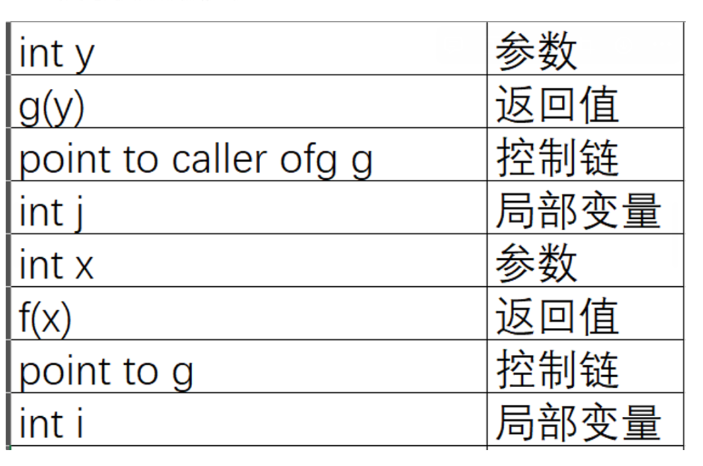

## 3.垃圾回收

### 3.1 引用计数

# 五、第八章 代码生成

## 1.三地址代码

> 要点：
>
> 1.都是  **左<-右**  ，dst 都在左边
>
> **2.数组的表示：**
>
> 假设为a[i],8字长
>
> ==**a(R1)=*(a+R1)**== ,相当于取内容
>
> | LD R1, i          |
> | ----------------- |
> | MUL R1, R1, 8     |
> | LD  R2, **a(R1)** |
> |                   |
>
>  
>
> ​	

> BLTZ:Branch  Less Than Zero”的缩写 

## 2.基本块

> - **只能从第一条指令进入**
> - **只能在最后一条语句跳转**
> - 用跳转语句GOTO进行划分

## 3.流图

## 4.循环

## 5.DAG

> 局部公共子表达式
>
> 消除死代码
>
> **数组的DAG**

## 6.寄存器和地址描述符

# 六、第九章 代码优化

## 1.局部公共子表达式

### 1.1 如何判断

> 如果表达式x op y先前已被计算过，并且**从先前的计算到现在，x op y中变量的值没有改变**，那么x op y的这次出现就称为公共子表达式 (common subexpression)

- B5基本块

 

##  2.复制传播

## 3.死代码

## 4.循环不变式

## 5.归纳变量与强度消减

## 6.到达定值

https://www.jianshu.com/p/b975b3decb6c

> gen 和 kill
>
> 
>
> 
>
> 

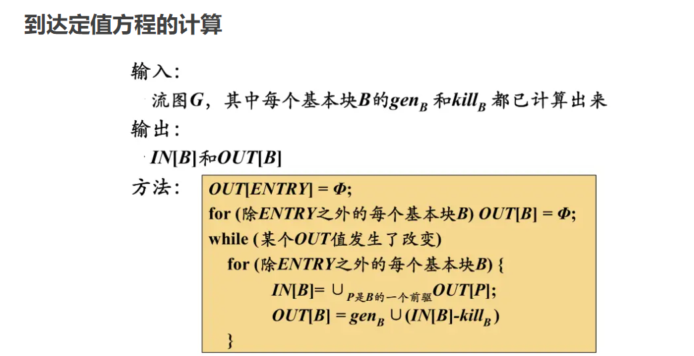

## 7.活跃变量

> $OUT[B_i]=∪IN[B_{i+1}]$
>
> $IN[Bi]=use_{B_i}∪(OUT[B_{i}]-def_B)$
>
> def:“=”左边的
>
> use:“=”右边的

https://www.jianshu.com/p/ebc1c72b881c

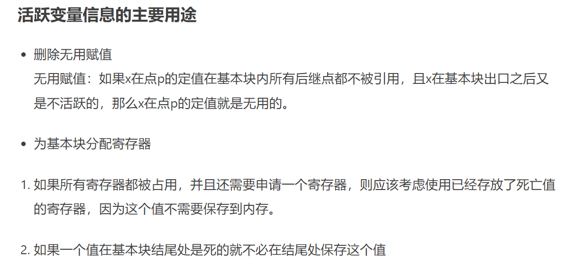

## 8.可用表达式

 https://www.jianshu.com/p/880ff59528b3

> 表达式是“=”右边的，定值是左边的

## 9.数据流分析

**到达-定值分析** 用于确定变量的定义可以到达程序的各个点，帮助优化变量定义的传播和**常量传播。**

**活跃变量分析** 用于识别程序中变量在何时活跃，主要用于寄存器分配和**死代码消除。**

**可用表达式分析** 用于识别程序中已经计算并且没有被修改的表达式，帮助优化**公共子表达式消除**和代码移动。

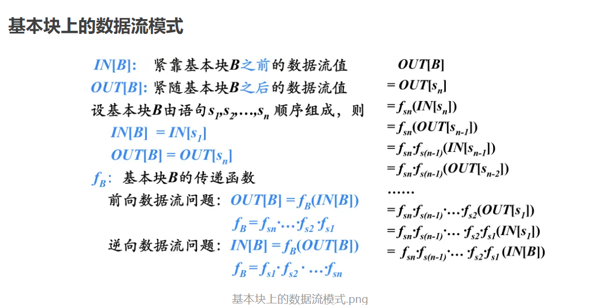

## 10.支配节点

## 11.自然循环

## :arrow_down_small: